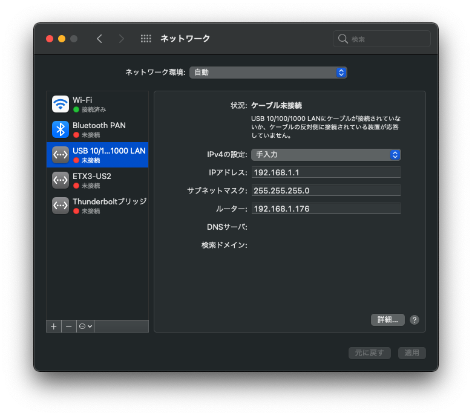
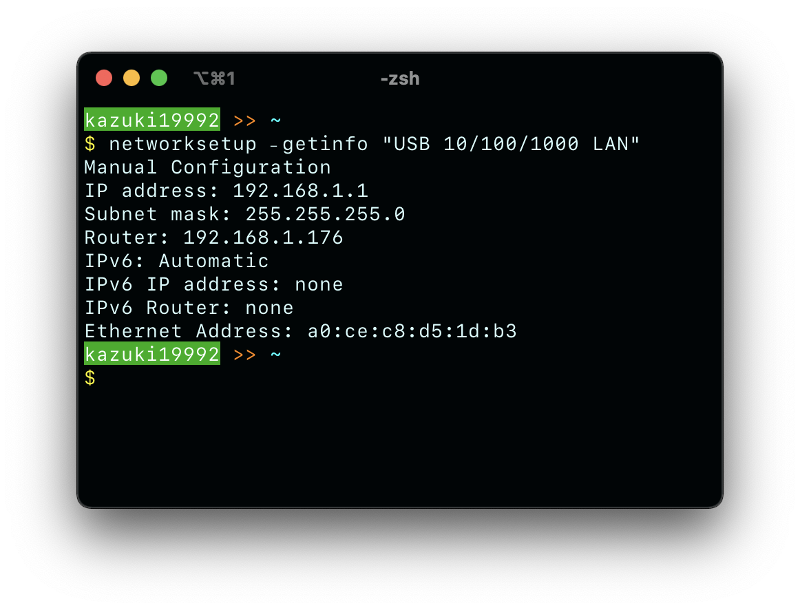

# 2

## 実機

### 1. ネットワーク設定

#### macOS

**IPアドレス類は授業で指定されたものを使用すること**

1. PCにEthernetケーブルを接続する
2. Spotlight検索で`System Preferences.app`と入力し、システム環境設定を開く(左上のリンゴマークから直接開くことも可能)
3. ネットワークを押下
4. Ethernetケーブルを接続しているインターフェースを選択する

*この場合は`USB 10/100/1000 LAN`が選択される*
5. IPv4の設定を`手入力`に変更する
6. IPアドレスを`192.168.1.1`に設定する
7. サブネットマスクを`255.255.255.0`に設定する
8. デフォルトゲートウェイを`192.168.1.100+ルータ番号`に設定する
9. ターミナルを起動する
10. ターミナルで`$ networksetup -getinfo "インターフェース名"`と入力し、ネットワーク設定が正しいか確認する

*このようにIPアドレス、サブネットマスク、ルーター(デフォルトゲートウェイ)のアドレスが表示される*

11. telnetでルーターにログインする。`$ telnet ルーターのIPアドレス`でログインすることが可能

### 2. ログの記録
macOSやLinuxにはTeraTermは存在しない。